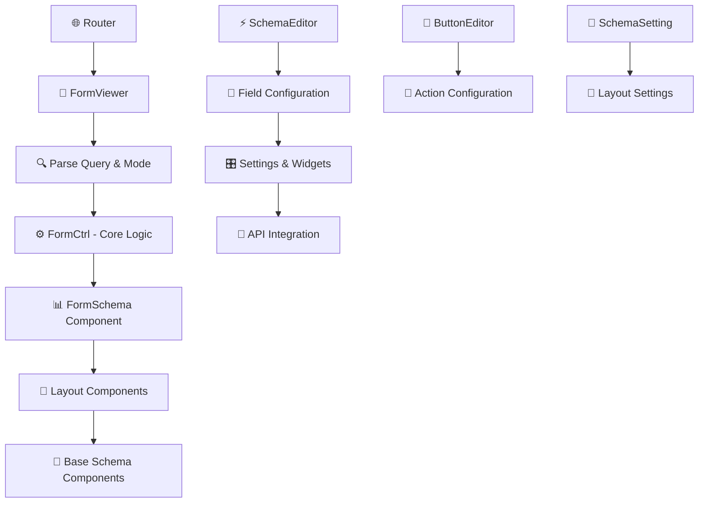
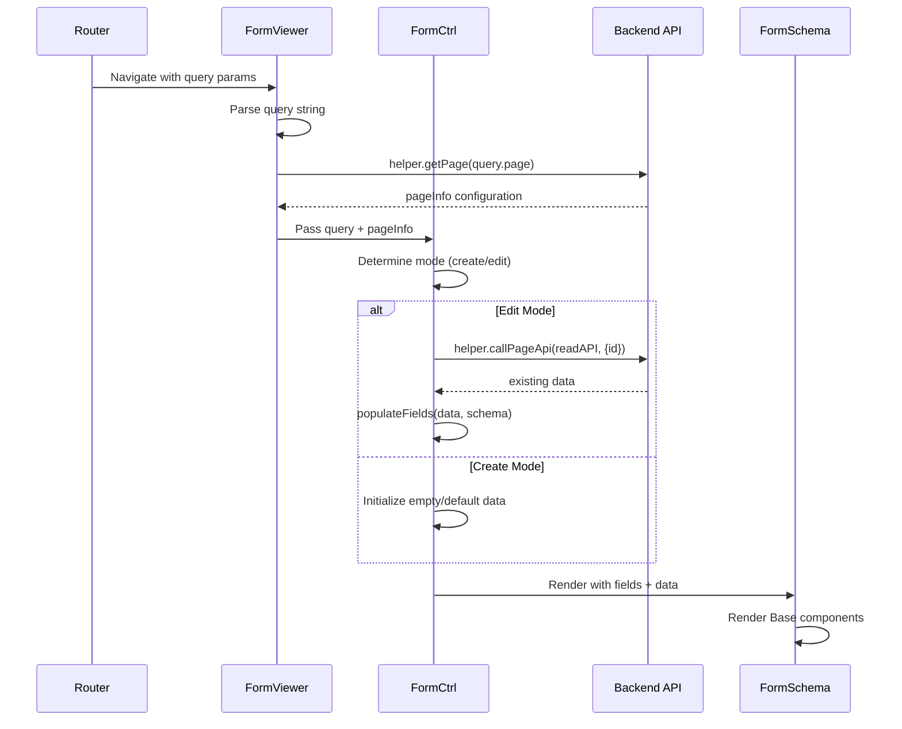
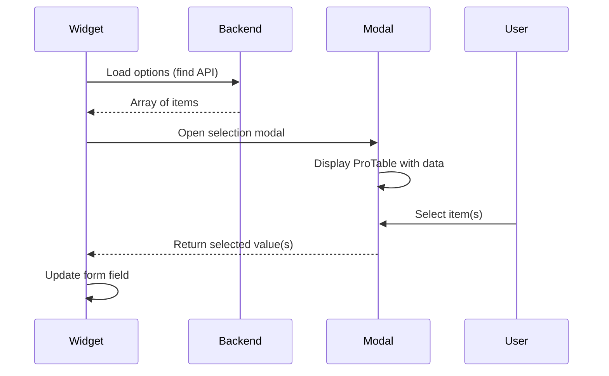
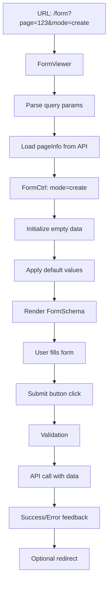
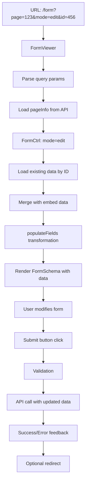

# Form System Architecture - Comprehensive Guide

## 📋 Tổng quan hệ thống

Hệ thống **Form** là một giải pháp form builder toàn diện được xây dựng trên React + TypeScript + Ant Design, cung cấp khả năng tạo và quản lý forms động với nhiều widget types và conditional logic phức tạp.

### 🎯 Các tính năng chính
- ✅ Dynamic form rendering với 20+ widget types
- ✅ Drag & drop field configuration
- ✅ Conditional field visibility (hideExpression)
- ✅ Flexible layout system (1-4 columns)
- ✅ API integration với model selection
- ✅ Real-time validation và error handling
- ✅ Role-based access control
- ✅ Responsive design
- ✅ Custom templates support
- ✅ Live preview trong configuration

## 🏗️ Kiến trúc tổng thể



## 📂 Cấu trúc thư mục

### **Core Components**
```
src/
├── routes/default/form/
│   └── FormViewer.tsx              # Entry point & container
├── controls/layouts/schemaTemplate/
│   └── FormCtrl.tsx                # Core business logic
├── controls/layouts/
│   ├── FormOneColumn.tsx           # Flexible column layout
│   └── FormTwoColumn.tsx           # Two-column layout
└── packages/pro-component/schema/
    ├── index.tsx                   # Main FormSchema component
    ├── Base.tsx                    # Field renderer
    └── [widgets]/                  # All form widgets
```

### **Configuration Tools**
```
src/controls/
├── editors/
│   ├── SchemaEditor.tsx            # Field configuration
│   ├── ButtonEditor.tsx            # Action buttons
│   ├── APIEditor.tsx               # API management
│   ├── ArrayEditor.tsx             # Complex data editor
│   └── OrderableList.tsx           # Drag & drop utility
└── settings/
    ├── SchemaSetting.tsx           # Form layout settings
    └── GridSetting.tsx             # Grid configuration
```

## 🔄 Luồng hoạt động chi tiết

### **1. Form Initialization Sequence**


### **2. Configuration Flow**
```mermaid
graph LR
    A[SchemaEditor] --> B[ISchemaEditorProperties[]]
    B --> C[SchemaSetting]
    C --> D[ISchemaSetting]
    D --> E[FormCtrl]
    E --> F[Layout Rendering]
    
    G[ButtonEditor] --> H[IButtonEditor[]]
    H --> I[Action Handling]
    
    J[APIEditor] --> K[API Definitions]
    K --> L[Model Widgets]
```

### **3. Data Transformation Flow**
```typescript
// Input Data Flow
URL Query → FormViewer.parseQuery()
         → FormCtrl.loadData()
         → API Response
         → populateFields(data, schema)
         → FieldData[]
         → FormSchema.render()

// Output Data Flow  
User Input → Base.onChange()
          → FormSchema.onChange(fields)
          → transformData(fields)
          → FormCtrl.setState({data})
          → onSubmit()
          → helper.callPageApi()
```

## 🎛️ Widget System

### **Widget Categories**
```typescript
const WIDGET_TYPES = {
  // Text Input Widgets
  TEXT_INPUT: ['Text', 'TextArea', 'Password', 'InputTag'],
  
  // Rich Content Widgets
  RICH_CONTENT: ['RichText', 'Image', 'ArrayImage', 'Icon'],
  
  // Selection Widgets
  SELECTION: ['Enum', 'EnumByUser', 'SingleSelect', 'ArraySelect'],
  
  // Model Widgets (API-driven)
  MODEL: ['SingleModel', 'ArrayModel', 'ArrayModelSort'],
  
  // Date/Time Widgets
  DATETIME: ['DateTime', 'Date', 'Time'],
  
  // Location Widgets
  LOCATION: ['Location', 'SuggestLocation'],
  
  // Special Widgets
  SPECIAL: ['ColorPicker', 'Upload', 'Captcha', 'NumberMask', 'Checkbox']
};
```

### **Widget Configuration Matrix**

| **Widget** | **Data Type** | **Special Props** | **Use Case** |
|------------|---------------|-------------------|--------------|
| **Text** | string/number | `maxLength`, `placeholder` | Basic text input |
| **TextArea** | string | `rows`, `maxLength` | Multi-line text |
| **DateTime** | number | `minDate`, `format` | Date/time picker |
| **Image** | string | `imageWidth`, `imageHeight` | File upload với constraints |
| **Enum** | string/number | `items[]` với ArrayEditor | Static dropdown options |
| **SingleModel** | number | `api`, `modelSelectField` | Select từ API data |
| **ArrayModel** | number[] | `api`, `modelSelectField`, modal | Multi-select từ API |
| **SuggestLocation** | string | `showMap` | Location với autocomplete |
| **ColorPicker** | string | Color palette | Color selection |
| **Upload** | string | File constraints | File upload |

### **Widget Development Pattern**
```typescript
// 1. Widget Interface
interface WidgetProps {
  schema: ISchemaEditorProperties;
  value: any;
  onChange: (value: any) => void;
  data: Record<string, any>;
  itemId?: string | number;
}

// 2. Widget Implementation
const CustomWidget: FC<WidgetProps> = ({ schema, value, onChange }) => {
  return (
    <AntdComponent
      value={value}
      onChange={onChange}
      disabled={schema.disabled}
      placeholder={schema.intro}
      // ... other props
    />
  );
};

// 3. Registration
// Add to widgets object in SchemaEditor.tsx
// Export in Widgets.tsx  
// Handle in Base.tsx
```

## ⚙️ Schema Configuration System

### **ISchemaEditorProperties - Core Interface**
```typescript
export interface ISchemaEditorProperties {
  // Basic Properties
  name: string;                    // Display label
  field: string;                   // Data field name
  type: 'string'|'number'|'boolean'; // Data type
  widget: string;                  // Widget type
  
  // Validation
  required?: boolean;              // Required field
  disabled?: boolean;              // Disable field
  
  // Display Control
  hideExpression?: string;         // Conditional visibility
  intro?: string;                  // Help text/placeholder
  
  // Layout Control
  flex?: string;                   // CSS flex (e.g., "0 0 50%")
  maxWidth?: string;               // CSS max-width
  
  // Widget-Specific Properties
  imageWidth?: number;             // For Image widgets
  imageHeight?: number;
  items?: Array<{                  // For Enum widgets
    key: string;                   // Display text
    value: any;                    // Actual value
    status?: string;               // Color status
    color?: string;                // Custom color
  }>;
  
  // Model Widget Properties
  api?: string;                    // API endpoint name
  modelSelectField?: string;       // "id$$ID,name$$Tên"
  modelSelectMultiple?: boolean;   // Multi-selection
  pageId?: number;                 // Page ID for modal
  
  // Advanced Properties
  default?: any;                   // Default value
  embed?: Array<{                  // Embedded data
    key: string;
    value: any;
  }>;
  minDate?: boolean;               // Date constraint
  showMap?: boolean;               // Location map
}
```

### **Configuration Examples**

#### **Text Field**
```json
{
  "name": "Tên khách hàng",
  "field": "customerName",
  "type": "string",
  "widget": "Text",
  "required": true,
  "intro": "Nhập tên đầy đủ của khách hàng",
  "maxWidth": "50%"
}
```

#### **Enum Field với Custom Colors**
```json
{
  "name": "Trạng thái",
  "field": "status", 
  "type": "string",
  "widget": "Enum",
  "items": [
    {"key": "Hoạt động", "value": "active", "status": "Success"},
    {"key": "Tạm dừng", "value": "inactive", "status": "Warning"},
    {"key": "Đã xóa", "value": "deleted", "status": "Error"}
  ]
}
```

#### **Model Selection Field**
```json
{
  "name": "Danh mục sản phẩm",
  "field": "categoryIds",
  "type": "number",
  "widget": "ArrayModel",
  "api": "find_categories",
  "modelSelectField": "id$$ID,name$$Tên danh mục,description$$Mô tả",
  "pageId": 123
}
```

#### **Conditional Field**
```json
{
  "name": "Lý do hủy",
  "field": "cancelReason",
  "type": "string", 
  "widget": "TextArea",
  "hideExpression": "status != 'cancelled'",
  "required": true
}
```

## 🎨 Layout System

### **ISchemaSetting - Layout Configuration**
```typescript
interface ISchemaSetting {
  // Template Selection
  layoutCtrl: string;              // Custom template name
  
  // Column Layout
  layout: 'oneCol' | 'twoCol';     // Layout type
  columns: number;                 // Number of columns (1-4)
  
  // Form Layout
  formLayout: 'horizontal' | 'vertical' | 'inline';
  colon: boolean;                  // Show colon after labels
  
  // Spacing
  horizontal: number;              // Horizontal gutter (px)
  vertical: number;                // Vertical gutter (px)
  
  // Dividers
  divider: 'none' | 'left' | 'center' | 'right';
  dividerText: boolean;            // Show divider text
  dividerTextItems?: Array<{       // Divider configurations
    show: boolean;
    title: string;
  }>;
}
```

### **Layout Components**

#### **FormOneColumn - Flexible Layout**
```typescript
// Features:
✅ 1-4 columns configurable
✅ Responsive breakpoints  
✅ Divider support
✅ Flex & maxWidth control
✅ Action buttons placement

// Column Calculation
const spanCol = 24 / settings.columns;

// Responsive Grid
<Col xxl={spanCol} xl={spanCol} lg={spanCol} 
     md={spanCol} sm={24} xs={24}>
```

#### **FormTwoColumn - Fixed Layout**
```typescript
// Features:
✅ Fixed 2-column layout
✅ Auto row calculation
✅ Pre-filtered hidden fields
✅ Simpler implementation

// Row-based Rendering
const totalRows = Math.ceil(filteredSchema.length / 2);
<Col md={12} sm={24}>
```

### **Layout Selection Guide**

| **Scenario** | **Recommended Layout** | **Reason** |
|--------------|----------------------|------------|
| Admin forms với nhiều fields | FormTwoColumn | Efficient space usage |
| Mobile-first forms | FormOneColumn | Better responsive |
| Forms cần dividers | FormOneColumn | Divider support |
| Complex field width control | FormOneColumn | Flex & maxWidth |
| Simple forms | FormTwoColumn | Less configuration |

## 🔧 Advanced Features

### **1. Conditional Logic System**

#### **hideExpression Syntax**
```javascript
// Basic comparison
"status == 'active'"

// Multiple conditions  
"status == 'active' && type != 'admin'"

// Numeric comparison
"age >= 18 && score > 80"

// Field existence check
"parentId && parentId != ''"

// Complex expressions
"(status == 'pending' || status == 'review') && createdBy == currentUserId"
```

#### **Runtime Evaluation**
```typescript
// In FormOneColumn.tsx
if (comp.hideExpression) {
  let str = comp.hideExpression;
  
  // Replace field names with actual values
  for (const i in copyData) {
    str = helper.replaceAll(str, i, copyData[i]);
  }
  
  try {
    if (window.eval(str)) return null; // Hide field
  } catch (err) {
    console.log('Invalid hideExpression:', err);
    return null;
  }
}
```

### **2. API Integration System**

#### **API Configuration**
```typescript
interface APIConfig {
  name: string;                    // API identifier
  type: 'create' | 'update' | 'find'; // Operation type
  url: string;                     // Endpoint URL
  method: 'GET' | 'POST' | 'PUT' | 'DELETE';
  roles?: string[];                // Role restrictions
  requestFields?: string;          // Fields to send
  responseFields?: string;         // Expected response fields
}
```

#### **Model Widget API Flow**


### **3. Button Action System**

#### **Button Configuration**
```typescript
interface IButtonEditor {
  mode: string;                    // create/edit/view
  title: string;                   // Button text
  action: 'api' | 'url' | 'report' | 'formModal' | 'iframe';
  
  // API Action
  api?: string;                    // API to call
  confirm?: string;                // Confirmation message
  backOnDone?: boolean;            // Navigate back after success
  
  // URL Action  
  url?: string;                    // Target URL
  embedUrl?: boolean;              // Embed form data in URL
  
  // Modal Action
  modalQuery?: string;             // Modal configuration JSON
  
  // Styling
  buttonType: 'primary' | 'default' | 'dashed' | 'text' | 'link';
  size: 'large' | 'middle' | 'small';
  danger?: boolean;
  ghost?: boolean;
  
  // Access Control
  roles?: string[];                // Role-based visibility
  hideExpression?: string;         // Conditional visibility
  disableExpression?: string;      // Conditional disable
}
```

#### **URL Templating**
```typescript
// Template variables in button URLs
url: "#/form?page=123&mode=edit&id=#id#&parentId=#parentId#"

// Runtime replacement
let processedUrl = button.url;
for (const field in formData) {
  processedUrl = processedUrl.replace(
    new RegExp(`#${field}#`, 'g'), 
    formData[field]
  );
}
```

## 🚀 Form Lifecycle

### **Create Mode Flow**


### **Edit Mode Flow**


### **Data Transformation**
```typescript
// populateFields: API data → FieldData[]
populateFields = (data: Record<string, any>, schemas: ISchemaEditorProperties[]): FieldData[] => {
  const fields: FieldData[] = [];
  schemas.forEach(schema => {
    fields.push({
      name: schema.field,
      value: data[schema.field] || schema.default || getDefaultByType(schema.type)
    });
  });
  return fields;
};

// transformData: FieldData[] → API data
transformData = (fields: FieldData[]): Record<string, any> => {
  const data: Record<string, any> = {};
  fields.forEach(field => {
    if (Array.isArray(field.name)) {
      data[field.name[field.name.length - 1]] = field.value;
    } else {
      data[field.name] = field.value;
    }
  });
  return data;
};
```

## 🎯 Best Practices

### **Performance Optimization**
```typescript
// 1. Component Memoization
export default React.memo(FormOneColumn);

// 2. Derived Values
const spanCol = useMemo(() => 24 / settings.columns, [settings.columns]);

// 3. Callback Optimization
const handleFieldChange = useCallback((fields: FieldData[]) => {
  setFields(fields);
  setData(transformData(fields));
}, []);

// 4. Conditional Rendering
const visibleSchema = useMemo(() => 
  schema.filter(field => !shouldHideField(field, data)), 
  [schema, data]
);
```

### **State Management**
```typescript
// ✅ DO: Immutable updates
const updateSchema = (index: number, property: string, value: any) => {
  const newSchema = [...schema];
  newSchema[index] = { ...newSchema[index], [property]: value };
  return newSchema;
};

// ❌ DON'T: Direct mutation
schema[index][property] = value;
```

### **Widget Development**
```typescript
// ✅ Widget Template
const MyWidget: FC<WidgetProps> = ({ schema, value, onChange, data }) => {
  const handleChange = useCallback((newValue: any) => {
    onChange(newValue);
  }, [onChange]);

  // Support all common schema properties
  if (schema.disabled) return <span>{value}</span>;
  
  return (
    <Input
      value={value || ''}
      onChange={(e) => handleChange(e.target.value)}
      placeholder={schema.intro}
      disabled={schema.disabled}
      required={schema.required}
    />
  );
};
```

### **Error Handling**
```typescript
// API Error Handling
try {
  const response = await helper.callPageApi(pageInfo, api, data);
  if (response.status === HttpStatusCode.OK && !response?.data?.errorCode) {
    helper.alert(response?.data.message || 'Thành công', 'success');
  } else {
    helper.alert(response?.data.message || 'Đã có lỗi xảy ra', 'error');
  }
} catch (err) {
  helper.alert(err.message || 'Network error', 'error');
}

// Hide Expression Error Handling
try {
  if (window.eval(hideExpression)) return null;
} catch (err) {
  console.warn('Invalid hideExpression:', hideExpression, err);
  return null; // Hide field on error
}
```

## 🐛 Troubleshooting Guide

### **Common Issues**

#### **Form không render**
```typescript
// Check sequence:
1. FormViewer.tsx - query parsing
2. helper.getPage() - pageInfo loading  
3. FormCtrl.tsx - mode detection
4. pageInfo.schema - field configuration
5. FormSchema - component rendering

// Debug:
console.log('Query:', query);
console.log('PageInfo:', pageInfo);
console.log('Schema:', pageInfo?.schema);
```

#### **Widget không hiển thị**
```typescript
// Check:
1. Widget có trong widgets object (SchemaEditor.tsx)
2. Widget được export trong Widgets.tsx
3. Base.tsx handle widget type
4. Schema configuration đúng

// Debug:
console.log('Widget type:', schema.widget);
console.log('Available widgets:', widgets[schema.type]);
```

#### **hideExpression không hoạt động**
```typescript
// Common mistakes:
❌ "status = 'active'"     // Assignment instead of comparison
✅ "status == 'active'"    // Correct comparison

❌ "age > '18'"           // String comparison
✅ "age > 18"             // Numeric comparison

❌ "field_name == 'value'" // Underscore in field name
✅ "fieldName == 'value'"  // CamelCase field name
```

#### **API không load data**
```typescript
// Check:
1. API configuration trong APIEditor
2. API name match trong widget config
3. modelSelectField format đúng "id$$ID,name$$Tên"
4. Backend API response format

// Debug:
console.log('API config:', apiConfig);
console.log('API response:', response.data);
```

### **Performance Issues**

#### **Form render chậm**
```typescript
// Solutions:
1. Sử dụng React.memo cho layout components
2. useMemo cho derived values
3. useCallback cho event handlers
4. Lazy load complex widgets
5. Virtualization cho large forms
```

#### **Memory leaks**
```typescript
// Solutions:
1. Cleanup useEffect dependencies
2. Remove event listeners
3. Cancel pending API calls
4. Clear intervals/timeouts
```

## 📚 Examples & Templates

### **Complete Form Configuration Example**
```json
{
  "schema": [
    {
      "name": "Tên sản phẩm",
      "field": "productName",
      "type": "string",
      "widget": "Text",
      "required": true,
      "maxWidth": "50%"
    },
    {
      "name": "Mô tả",
      "field": "description", 
      "type": "string",
      "widget": "TextArea",
      "flex": "0 0 100%"
    },
    {
      "name": "Danh mục",
      "field": "categoryId",
      "type": "number",
      "widget": "SingleModel",
      "api": "find_categories",
      "modelSelectField": "id$$ID,name$$Tên danh mục"
    },
    {
      "name": "Giá bán",
      "field": "price",
      "type": "number", 
      "widget": "Text",
      "hideExpression": "categoryId == 1"
    }
  ],
  "settings": {
    "layout": "oneCol",
    "columns": 2,
    "horizontal": 16,
    "vertical": 16,
    "divider": "left"
  }
}
```

### **Custom Widget Example**
```typescript
// 1. Create widget file
// src/packages/pro-component/schema/MyCustomWidget.tsx
import React, { FC } from 'react';
import { Input, Select } from 'antd';

interface MyCustomWidgetProps {
  schema: any;
  value: any;
  onChange: (value: any) => void;
  data: any;
}

const MyCustomWidget: FC<MyCustomWidgetProps> = ({ 
  schema, value, onChange 
}) => {
  return (
    <Input.Group compact>
      <Input 
        style={{ width: '70%' }}
        value={value?.text || ''}
        onChange={(e) => onChange({...value, text: e.target.value})}
      />
      <Select
        style={{ width: '30%' }}
        value={value?.type || 'default'}
        onChange={(type) => onChange({...value, type})}
      >
        <Select.Option value="default">Default</Select.Option>
        <Select.Option value="custom">Custom</Select.Option>
      </Select>
    </Input.Group>
  );
};

export default MyCustomWidget;

// 2. Export in Widgets.tsx
export { default as MyCustomWidget } from './MyCustomWidget';

// 3. Add to SchemaEditor.tsx widgets object
const widgets = {
  string: [...existing, 'MyCustomWidget'],
  // ...
};

// 4. Handle in Base.tsx
case 'MyCustomWidget':
  return <Widgets.MyCustomWidget {...props} />;
```

---

## 📖 Kết luận

Hệ thống **Form** cung cấp một framework mạnh mẽ và linh hoạt để xây dựng forms phức tạp mà không cần code. Với kiến trúc **configuration-driven**, developers có thể:

### **🎯 Key Benefits**
- **⚡ Rapid Development**: Tạo forms chỉ với JSON config
- **🎨 Rich UI**: 20+ widgets với full customization
- **🔧 Flexible Layout**: 1-4 columns với responsive design  
- **🔌 API Integration**: Seamless backend connectivity
- **🎯 Conditional Logic**: Dynamic form behavior
- **📱 Mobile-First**: Responsive design tự động
- **🚀 Performance**: Optimized rendering và state management

### **🛠️ Technical Excellence**
- **Clean Architecture**: Separation of concerns
- **Type Safety**: Full TypeScript support
- **Performance**: React.memo + useMemo optimizations
- **Maintainability**: Modular component design
- **Extensibility**: Easy widget development
- **Testing**: Isolated, testable components

Hệ thống này đã chứng minh hiệu quả trong việc giảm thời gian development và tăng consistency across ứng dụng, đồng thời cung cấp flexibility cần thiết cho business requirements phức tạp. 