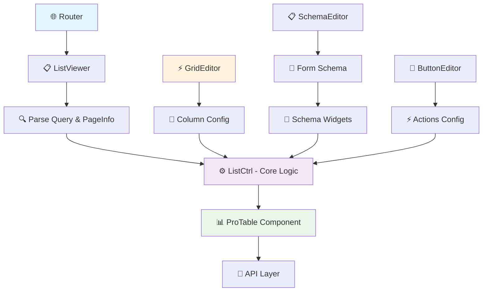
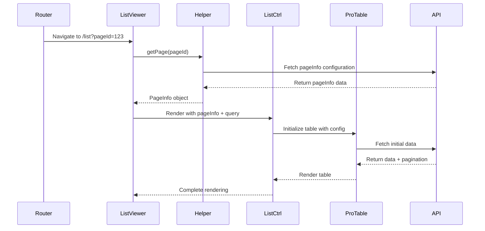

# List System Architecture - Comprehensive Guide

## 📋 Tổng quan hệ thống

Hệ thống **List** là một giải pháp data grid toàn diện được xây dựng trên React + TypeScript + Ant Design, cung cấp khả năng hiển thị, quản lý và tương tác với dữ liệu dạng bảng một cách linh hoạt và mạnh mẽ.

### 🎯 Các tính năng chính
- ✅ Hiển thị dữ liệu dạng bảng với pagination
- ✅ Filter, sort, search nâng cao  
- ✅ Selection (single/multiple) với các widget phong phú
- ✅ CRUD operations tích hợp
- ✅ Responsive design
- ✅ Customizable columns và layouts
- ✅ Export/Import data
- ✅ Real-time updates

## 🏗️ Kiến trúc tổng thể



## 📁 Cấu trúc thư mục

```
src/
├── routes/default/list/
│   └── ListViewer.tsx              # 🚪 Entry point từ router
├── controls/layouts/gridTemplate/
│   ├── ListCtrl.tsx               # 🧠 Core logic component  
│   └── data/                      # 📊 Data utilities
├── controls/editors/
│   ├── GridEditor.tsx             # ⚙️ Column configuration
│   ├── SchemaEditor.tsx           # 📝 Form schema editor
│   └── ButtonEditor.tsx           # 🔘 Action buttons config
├── packages/pro-component/schema/
│   ├── ArrayModel.tsx             # 🔗 Multi-select modal
│   ├── SingleModel.tsx            # 🎯 Single-select modal
│   ├── ArraySelect.tsx            # 📋 Multi-select dropdown
│   ├── ArrayTable.tsx             # 📊 Reusable table core
│   └── ...                       # 🧩 Other schema widgets
└── packages/pro-table/
    ├── Table.tsx                  # 📊 Enhanced Ant Design Table
    ├── component/                 # 🔧 Table utilities
    └── form/                      # 📝 Search form components
```

## 🔄 Luồng hoạt động chi tiết

### 1. 🚀 Initialization Flow



### 2. 📊 Data Loading & Display

```typescript
// ListCtrl - Main data fetching logic
const fetchData = async (params, sorter, filters) => {
  // 1. Xử lý parameters
  const queryParams = {
    select: getSelectFields(),
    sort: processSorter(sorter),
    queryInput: JSON.stringify(processFilters(filters)),
    limit: params.pageSize,
    skip: params.pageSize * (params.current - 1)
  };
  
  // 2. Call API
  const response = await helper.callPageApi(pageInfo, api, queryParams);
  
  // 3. Transform data for table
  return {
    data: response.data.data,
    success: true,
    total: response.data.count
  };
};
```

### 3. ⚙️ Column Configuration

```typescript
// GridEditor - Column definition
interface GridColumn {
  name: string;           // Display name
  field: string;          // Data field
  type: DATA_TYPE;        // Data type
  display?: string;       // Display type (money, date, etc.)
  width?: number;         // Column width
  filterable?: boolean;   // Enable filtering
  sorter?: boolean;       // Enable sorting
  enumable?: string;      // Enum values
  widget?: string;        // Schema widget for editing
}

// Được transform thành ProTable columns
const columns = gridConfig.map(col => ({
  title: col.name,
  dataIndex: col.field,
  sorter: col.sorter,
  render: getRenderFunction(col.display, col.type),
  filters: getFilters(col.enumable),
  // ... other ProTable column props
}));
```

### 4. 🧩 Schema Widget Integration

```typescript
// Schema widgets cho các field phức tạp
const SchemaWidgets = {
  ArrayModel: (props) => {
    // Multi-select modal với ProTable
    return (
      <Modal>
        <ProTable
          rowSelection={{ type: 'checkbox' }}
          request={fetchDataFromPageId}
          // ... full table features
        />
      </Modal>
    );
  },
  
  SingleModel: (props) => {
    // Single-select modal với ProTable  
    return (
      <Modal>
        <ProTable
          rowSelection={{ type: 'radio' }}
          request={fetchDataFromPageId}
          // ... full table features
        />
      </Modal>
    );
  }
};
```

## 🎨 Các Component chính

### 🚪 ListViewer.tsx - Container Component

```typescript
interface ListViewerProps {
  location?: any; // React Router location
}

// Chức năng:
// ✅ Parse query parameters từ URL
// ✅ Fetch pageInfo configuration từ API
// ✅ Render ListCtrl hoặc custom GridTemplate
// ✅ Handle routing và navigation
```

**Đặc điểm:**
- Entry point từ React Router
- Quản lý state loading và error handling
- Điều hướng giữa list view và detail view
- Xử lý query string parameters

### 🧠 ListCtrl.tsx - Core Logic Component

```typescript
interface ListCtrlProps {
  query: any;        // URL query parameters
  pageInfo: any;     // Page configuration
  authUser?: any;    // User authentication info
}

interface ListCtrlState {
  data: Array<any>;           // Table data
  columns: Array<any>;        // Column definitions
  loading: boolean;           // Loading state
  selectedRowKeys: any[];     // Selected rows
  pagination: PaginationConfig;
  // ... other state
}
```

**Chức năng chính:**
- 🔄 Data fetching với pagination, sort, filter
- 📊 Column rendering và customization
- 🎯 Row selection và bulk actions
- 📱 Responsive layout handling
- ⚡ Real-time data updates
- 💾 State persistence

### 📊 ProTable Integration

```typescript
// ProTable - Enhanced Ant Design Table
<ProTable
  actionRef={actionRef}
  request={fetchData}                    // Async data loading
  columns={columns}                      // Column definitions
  rowSelection={rowSelection}            // Selection config
  search={searchConfig}                  // Search form
  toolBarRender={toolBarRender}         // Custom toolbar
  tableAlertRender={tableAlertRender}   // Selection alerts
  pagination={paginationConfig}         // Pagination
  // ... many more features
/>
```

## 🧩 Schema Widgets cho List

### 🔗 ArrayModel - Multi-Select Modal

```typescript
// Sử dụng cho quan hệ nhiều-nhiều (many-to-many)
const arrayModelSchema = {
  widget: 'ArrayModel',
  pageId: 456,                    // Target page ID
  modelSelectField: 'id$$ID,name$$Name,email$$Email',
  api: '/api/users',             // Data source API
  embed: [                       // Filter conditions
    { key: 'status', value: 'active' },
    { key: 'roleId', value: '--currentUserRole' }
  ]
};

// Features:
// ✅ Full ProTable với search, filter, sort
// ✅ Checkbox selection
// ✅ Tag display cho selected items
// ✅ Remove individual selections
// ✅ Embedded filters support
```

### 🎯 SingleModel - Single-Select Modal

```typescript
// Sử dụng cho quan hệ nhiều-một (many-to-one)  
const singleModelSchema = {
  widget: 'SingleModel',
  pageId: 789,
  modelSelectField: 'id$$ID,name$$Category Name',
  api: '/api/categories'
};

// Features:
// ✅ Radio selection
// ✅ Search và filter capabilities
// ✅ Single value selection
// ✅ Clear selection option
```

### 📋 ArraySelect - Compact Dropdown

```typescript
// Dropdown nhỏ gọn cho quick selection
const arraySelectSchema = {
  widget: 'ArraySelect',
  type: 'checkbox', // hoặc 'radio'
  pageId: 123,
  modelSelectField: 'id$$ID,name$$Name'
};

// Features:
// ✅ Dropdown trigger
// ✅ Embedded table trong overlay
// ✅ Compact display
// ✅ Quick selection
```

## ⚙️ Configuration System

### 📝 PageInfo Structure

```typescript
interface PageInfo {
  id: number;
  name: string;
  description: string;
  grid: GridConfig[];      // Column definitions
  schema: SchemaConfig[];  // Form field definitions  
  buttons: ButtonConfig[]; // Action buttons
  api: string;            // Data API endpoint
  layout?: string;        // Custom layout template
  permissions: string[];   // User permissions
}
```

### 📊 Grid Configuration

```typescript
interface GridConfig {
  name: string;           // Column display name
  field: string;          // Data field name
  type: DATA_TYPE;        // STRING, NUMBER, DATE, etc.
  display: DISPLAY_TYPE;  // Default, Money, Date, Avatar, etc.
  width?: number;         // Column width
  filterable: boolean;    // Enable column filter
  sorter: boolean;       // Enable column sort
  enumable?: string;     // Enum values for filter
  widget?: string;       // Schema widget for editing
  required?: boolean;    // Required field
  readonly?: boolean;    // Read-only field
}
```

### 🎨 Schema Configuration

```typescript
interface SchemaConfig {
  field: string;          // Field name
  name: string;           // Display label
  widget: string;         // Widget type
  type: DATA_TYPE;        // Data type
  required: boolean;      // Required validation
  default?: any;          // Default value
  placeholder?: string;   // Input placeholder
  intro?: string;         // Help text
  disabled?: boolean;     // Disabled state
  // Widget-specific properties
  pageId?: number;        // For model widgets
  modelSelectField?: string; // Field selection
  items?: EnumItem[];     // For enum widgets
}
```

## 🎯 Patterns và Best Practices

### 1. 🆕 Tạo List Page mới

```typescript
// Bước 1: Define pageInfo trong backend
const pageInfo = {
  name: "User Management",
  api: "/api/users",
  grid: [
    { name: "ID", field: "id", type: "NUMBER", sorter: true },
    { name: "Name", field: "name", type: "STRING", filterable: true },
    { name: "Email", field: "email", type: "STRING", filterable: true },
    { name: "Role", field: "roleId", type: "NUMBER", widget: "SingleModel", pageId: 456 }
  ],
  schema: [
    { field: "name", name: "Full Name", widget: "Text", required: true },
    { field: "email", name: "Email", widget: "Text", required: true },
    { field: "roleId", name: "Role", widget: "SingleModel", pageId: 456 }
  ]
};

// Bước 2: Route configuration
<Route path="/users" component={ListViewer} />
// URL: /users?pageId=123

// Bước 3: Auto-generated UI từ configuration
```

### 2. 🔧 Customize Column Rendering

```typescript
// Trong GridEditor, extend display types
const customDisplayTypes = {
  'avatar': (value, record) => (
    <Avatar src={value} alt={record.name} />
  ),
  'status-badge': (value) => (
    <Badge status={value === 'active' ? 'success' : 'error'} text={value} />
  ),
  'money-vnd': (value) => (
    <span>{new Intl.NumberFormat('vi-VN', { 
      style: 'currency', 
      currency: 'VND' 
    }).format(value)}</span>
  )
};

// Sử dụng trong column config
{
  name: "Avatar",
  field: "avatarUrl", 
  type: "STRING",
  display: "avatar"
}
```

### 3. 🔗 Quan hệ dữ liệu phức tạp

```typescript
// Many-to-Many: User ↔ Roles
{
  field: "roleIds",
  name: "Roles",
  widget: "ArrayModel",
  pageId: 456, // Roles page
  modelSelectField: "id$$ID,name$$Role Name,description$$Description"
}

// One-to-Many với filter: User → Department
{
  field: "departmentId", 
  name: "Department",
  widget: "SingleModel",
  pageId: 789,
  embed: [
    { key: "companyId", value: "--currentUserCompany" },
    { key: "status", value: "active" }
  ]
}
```

### 4. 📱 Responsive Design

```typescript
// Column responsive configuration
const responsiveColumns = [
  {
    name: "Name",
    field: "name",
    responsive: ['sm'], // Ẩn trên mobile
  },
  {
    name: "Email", 
    field: "email",
    responsive: ['md'], // Ẩn trên tablet nhỏ
  }
];

// Mobile-first approach
const mobileColumns = columns.filter(col => 
  !col.responsive || col.responsive.includes(currentBreakpoint)
);
```

## 🛠️ Troubleshooting Guide

### ❌ Các lỗi thường gặp

**1. "Cannot read property 'map' of undefined"**
```typescript
// ✅ Giải pháp: Kiểm tra pageInfo loading
{pageInfo?.grid?.length > 0 ? (
  <ListCtrl pageInfo={pageInfo} query={query} />
) : (
  <Loading />
)}
```

**2. "API endpoint not found"**
```typescript
// ✅ Giải pháp: Verify API configuration
const apiEndpoint = pageInfo?.api || '/api/default';
console.log('API Endpoint:', apiEndpoint);
```

**3. "Column rendering error"**
```typescript
// ✅ Giải pháp: Safe column rendering
const renderColumn = (value, record, column) => {
  try {
    return getDisplayRenderer(column.display)?.(value, record) || value;
  } catch (error) {
    console.error('Column render error:', error);
    return value || '-';
  }
};
```

### 🔍 Debug Tools

```typescript
// Enable debug mode
localStorage.setItem('DEBUG_LIST', 'true');

// Component debug info
const debugInfo = {
  pageInfo: pageInfo,
  query: query,
  columns: columns,
  data: data,
  loading: loading
};

console.table(debugInfo);
```

## 🚀 Performance Optimization

### 1. 📊 Data Loading Optimization

```typescript
// Virtual scrolling cho large datasets
const virtualTableConfig = {
  scroll: { y: 400, x: 1200 },
  pagination: { 
    showSizeChanger: true,
    showQuickJumper: true,
    showTotal: (total, range) => 
      `${range[0]}-${range[1]} of ${total} items`
  }
};

// Debounced search
const debouncedSearch = useMemo(
  () => debounce((value) => {
    setSearchParams({ ...searchParams, search: value });
  }, 300),
  [searchParams]
);
```

### 2. 💾 Caching Strategy

```typescript
// PageInfo caching
const pageInfoCache = new Map();

const getPageInfo = async (pageId) => {
  if (pageInfoCache.has(pageId)) {
    return pageInfoCache.get(pageId);
  }
  
  const pageInfo = await helper.getPage(pageId);
  pageInfoCache.set(pageId, pageInfo);
  return pageInfo;
};
```

### 3. 🔄 State Management

```typescript
// Optimize re-renders
const MemoizedListCtrl = React.memo(ListCtrl, (prevProps, nextProps) => {
  return (
    prevProps.pageInfo?.id === nextProps.pageInfo?.id &&
    isEqual(prevProps.query, nextProps.query)
  );
});
```

## 📚 API Reference

### Helper Functions

```typescript
// src/controls/controlHelper.ts
helper.getPage(pageId: number): Promise<PageInfo>
helper.callPageApi(pageInfo: PageInfo, api: string, params: any): Promise<ApiResponse>
helper.transformModelSelectField(selectField: string): Record<string, string>
helper.getValue(value: any): any
```

### ProTable Props

```typescript
interface ProTableProps {
  request: (params, sorter, filter) => Promise<RequestData>;
  columns: ProColumnType[];
  rowSelection?: TableRowSelection;
  search?: SearchConfig | boolean;
  pagination?: PaginationConfig | false;
  toolBarRender?: () => React.ReactNode[];
  // ... more props
}
```

## 🎓 Learning Resources

### 📖 Recommended Reading Order

1. **Cơ bản**: Đọc file này để hiểu tổng quan
2. **ListViewer**: Xem entry point và routing
3. **ListCtrl**: Hiểu core logic và data flow
4. **ProTable**: Tìm hiểu table component features
5. **Schema Widgets**: Học các widget cho form fields
6. **GridEditor**: Hiểu cách config columns
7. **Performance**: Tối ưu hóa cho production

### 🔗 Related Documentation

- [Ant Design Table](https://ant.design/components/table/)
- [React Router](https://reactrouter.com/)
- [TypeScript](https://www.typescriptlang.org/)
- [Project Schema System](./SCHEMA_SYSTEM.md)

---

## 📞 Support

Nếu có thắc mắc về hệ thống List, vui lòng:

1. 🔍 Kiểm tra Cursor Rules: `.cursor/rules/list-system.mdc`
2. 🐛 Report bugs via issue tracker
3. 💬 Thảo luận trong team chat
4. 📚 Tham khảo code examples trong project

**Chúc bạn code vui vẻ! 🎉** 